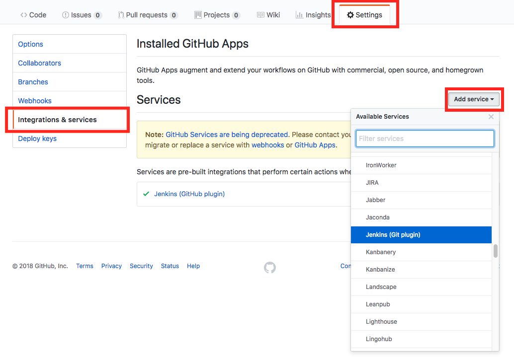
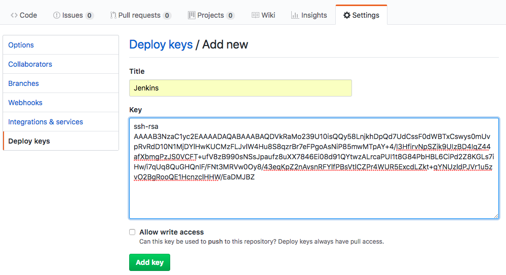
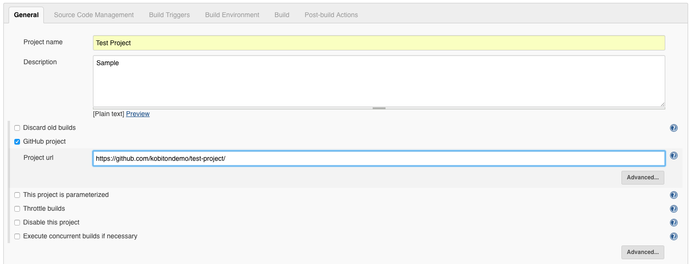
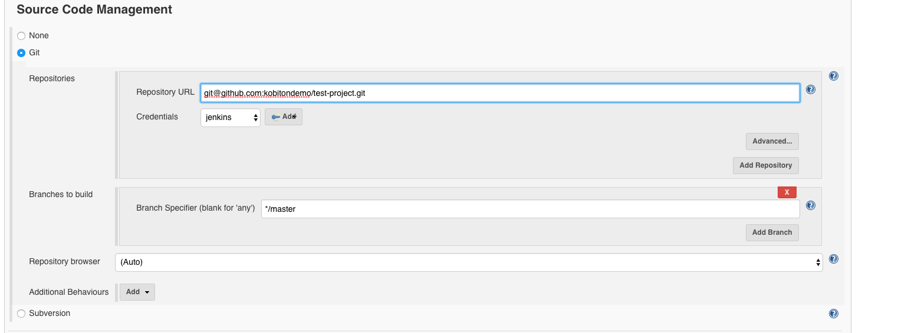
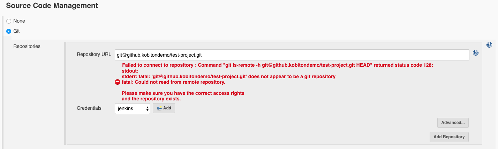
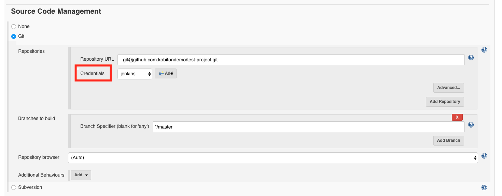
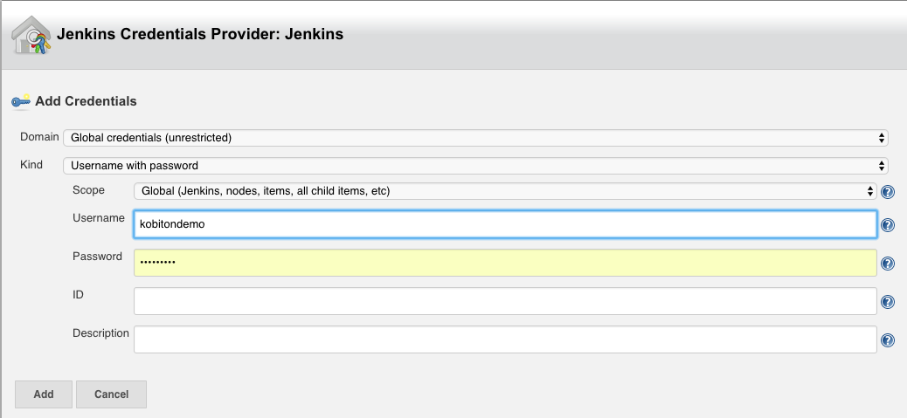
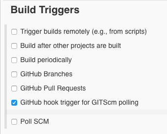

# Triggering a Jenkins build from a push to GitHub

This guide will demonstrate how to get Jenkins to build your project everytime your source code is changed and pushed to GitHub. 

### Prerequisites

* Install Jenkins

#### 1.1 Install the GitHub integration plugin

* On Jenkins, go to 'Manage Jenkins' and then click on 'Manage Plugins'. 


* Click on the tab 'Available', search for the GitHub Integration Plugin, and install it.


#### 1.2 Configure GitHub repo to push to Jenkins

* Go to your Github, click on Settings, and then go to 'Integration & services'. Add the Jenkins Github plugin.



* Once you've added the plugin, click on it. For 'Jenkins hook url', enter in the URL of your Jenkins instance, e.g. https://awesome-mapp.com/, followed by /github-webhook/ 


**SSH Key**

If you do not already have an SSH key, you can generate one with the following command in your terminal. 

```
ssh-keygen
```
Copy the public key. This may vary depending on where the key was generated. 
```
cat /var/lib/jenkins/.ssh/id_rsa.pub
```
In GitHub, go to 'Settings' and 'Deploy keys'. Click on 'Add deploy key' and paste the SSH key you just created. 



#### 1.3 Allow Jenkins to access GitHub repository

* Upload the app you want to test to a GitHub repo. 

* Go to Jenkins and create a new freestyle project.

* In Jenkins, go to the configuration of your project. Under the tab 'General', check the box that says 'GitHub project' and enter in your project url. 



* Under the Source Code Management, add the repository URL with 'git@github.com:' before your repo. 



> Troubleshooting

You may see an error from adding your repository URL if your "Credentials" are set to "None".  



To fix this, we must add a credential. Under the "Source Code Management" section in "Credentials", click on the 'Add' button.



There are several kinds of credentials you may choose.

1. Username with password

Enter in the username that will be used to connect to the git repository. You may leave the ID and Description field empty. 
    


2. SSH Username with private key

Enter in the username that will be used to connect to the git repository.

There are three options for the Private Key. If you choose to Enter directly, you may have to retrieve your RSA private key.

Enter in The passphrase for your key. 

You may leave the ID and Description empty. 

Select the Credential you just created in the Credentials dropdown. 

* Under the 'Build Triggers' section, check the box with 'GitHub hook trigger for GITScm polling'. 



**Jenkins (GitHub plugin)**

Make a push to your GitHub repository and then check Jenkins to see if a build was done successfully. 
