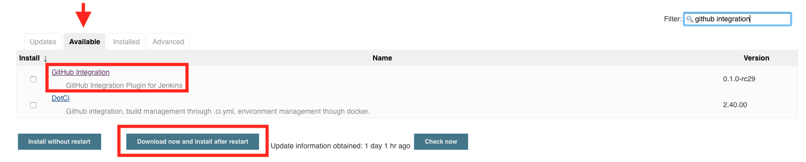
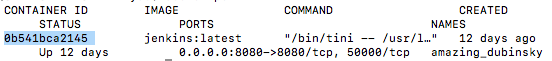
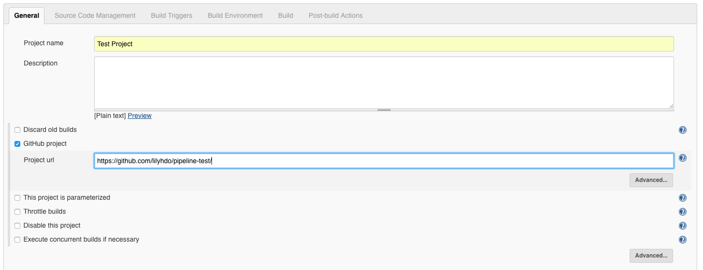
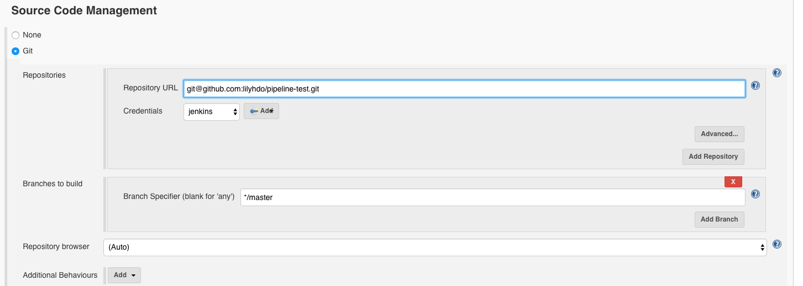

# 1. Triggering a Jenkins build from a push to GitHub

Guidance on integrating Kobiton service into the build pipeline of mobile app development: Jenkins, HockeyApp, Appium and ReactNative

**Triggering a Jenkins build from a push to GitHub**

Upload the app you want to test to a GitHub repo. 

Go to Jenkins and create a new freestyle project.

1. Install the GitHub integration plugin

On Jenkins, go to 'Manage Jenkins' and then click on 'Manage Plugins'. 


Click on the tab 'Available', search for the GitHub Integration Plugin, and install it.



2. Prepare GitHub repository

Go to your Github, click on Settings, and then go to 'Integration & services'. Add the Jenkins Github plugin.


Once you've added the plugin, click on it. For 'Jenkins hook url', enter in the URL of your Jenkins instance, followed by /github-webhook/ 


3. Add SSH key to GitHub

If you do not already have an SSH key, you can generate one with the following command in your terminal. 

```
ssh-keygen
```
Copy the public key. This may vary depending on where the key was generated. 
```
cat /var/lib/jenkins/.ssh/id_rsa.pub
```
In GitHub, go to 'Settings' and 'Deploy keys'. Click on 'Add deploy key' and paste the SSH key you just created. 


Since we are running Jenkins in a Docker container, we need to run commands as the Jenkins user and not just in your local terminal. 

To do this, go to your terminal and enter 
```
docker ps
```
Copy the status. 



Then run this command with your status:
```
docker exec -it 0b541bca2145 /bin/bash
```
Now that you are in the console as the Jenkins user. To check everything is working, enter the following: 
```
jenkins@04n971ew0224:/$ ssh git@github.com
```


If everything is correct, you should see: 
```
PTY allocation request failed on channel 0
Hi lilyhdo! You've successfully authenticated, but GitHub does not provide shell access.
Connection to github.com closed.
```

4. Add GitHub project to Jenkins configuration

In Jenkins, go to the configuration of your project. Under the tab 'General', check the box that says 'GitHub project' and enter in your project url. 



Under the Source Code Management, add the repository URL with 'git@github.com:' before your repo. 



> Troubleshooting

You may see an error from adding your repository URL if your "Credentials" are set to "None".  


To fix this, we must add a credential. Under the "Source Code Management" section in "Credentials", click on the 'Add' button.


There are several kinds of credentials you may choose.

- Username with password

Enter in the username that will be used to connect to the git repository. You may leave the ID and Description field empty. 


- SSH Username with private key

Enter in the username that will be used to connect to the git repository.

There are three options for the Private Key. If you choose to Enter directly, you may have to retrieve your RSA private key.

Enter in The passphrase for your key. 

You may leave the ID and Description empty. 

Select the Credential you just created in the Credentials dropdown. 

>For more information on setting up the credentials, refer to https://www.thegeekstuff.com/2016/10/jenkins-git-setup/

Under the 'Build Triggers' section, check the box with 'GitHub hook trigger for GITScm polling'. 


**Jenkins (GitHub plugin)**

Make a push to your GitHub repository and then check Jenkins to see if a build was done successfully. 

