# 2. Running automation test with Kobiton

## 2.1 Prerequisites

* Username 
1. Go to portal.kobiton.com
2. In the upper right hand corner, click on your name and in the drop down menu, click on Profile. 

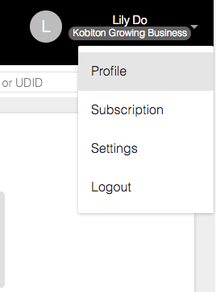

3. You should see the username. 

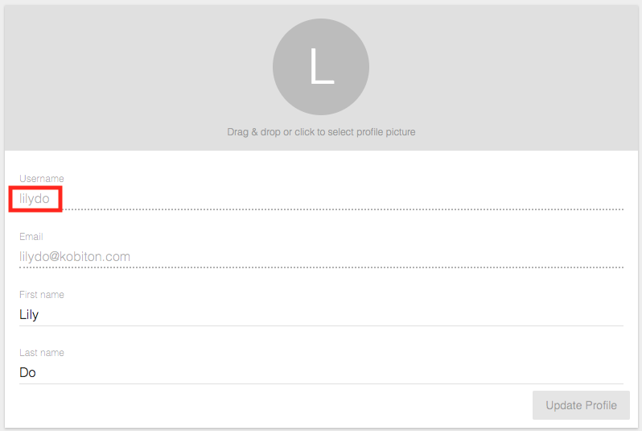

* API key
1. Click on your name in the upper righthand corner again and select settings. 
2. You should be able to find your API key under 'API Keys'. 

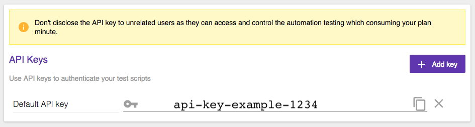

* Desired cap
1. In the navigation bar at the top of the Kobiton website, select Devices. 
2. Hover over any device and click on the Automation settings button (the gear symbol). 

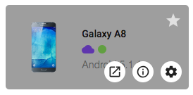

3. On the left hand side, you can select your preferred language, as well as any other variables you would like to adjust, such as **App Type**, **Device Group**, and **Orientation**. Adjusting the settings on the left side will affect the desiredCaps, which you can find in the right side of the window. 

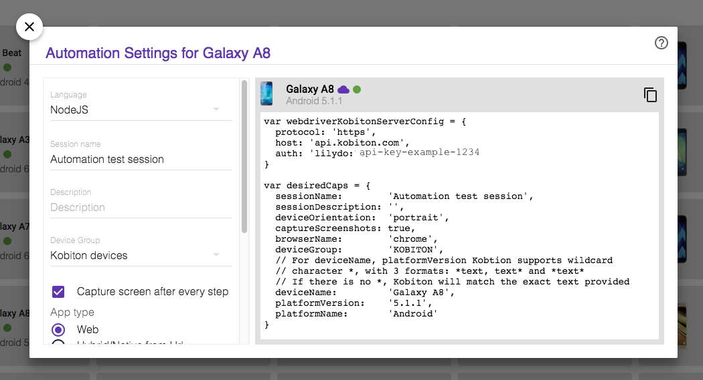

## 2.2 Setup Jenkins
#### How to setup Jenkins to run automation testing

Jenkins is an open source automation server that provides hundreds of plugins to support building, deploying, and automating any project. 

Docker is a desktop app for building, debugging, and testing Dockerized apps on a Mac. We will be running Jenkins through a Docker container. 

1. Download Jenkins from https://jenkins.io/
2. Download Docker from https://www.docker.com/

After finishing the installations, run Docker and then go to the terminal and run the following commands. 

```
docker run -d -p 8080:8080 jenkins
```

```
docker ps
```
Copy the status (highlighted in the image below) and enter it in the next command.  

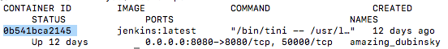

```
docker exec -it 0b541bce2145 /bin/bash
```
Copy the admin password that shows up, and go to http://localhost:8080

Enter in your Kobiton username and password. After logging in, enter the admin password you got from the terminal when Jenkins prompts you to do so. 

### 2.2.1 For Jenkins Freestyle
On the left side on the page, click on New Item to start a new Jenkins project. 

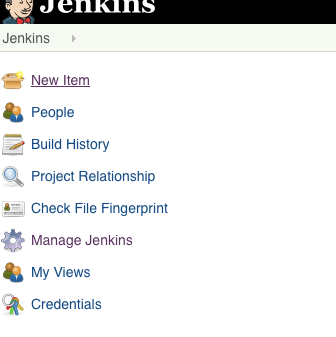

Enter in a name for the project and select 'Freestyle project'. Hit 'OK'. 

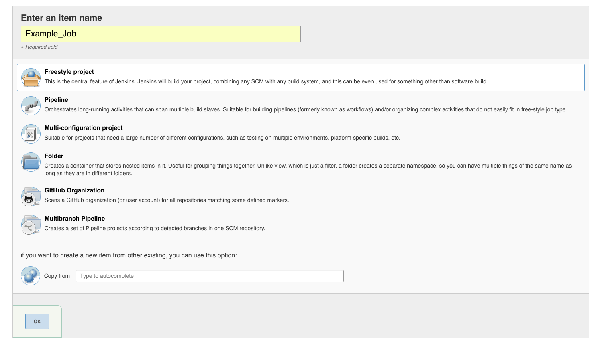

### 2.2.2 For Jenkins Pipeline
On the left side on the page, click on New Item to start a new Jenkins project. 

Enter in a name for the project and select 'Pipeline'. Hit 'OK'. 

## 2.3 Running automation testing

### 2.3.1 Test scripts

* How to write a simple test

For examples of automation tests, go to https://github.com/kobiton/samples . Choose a language for your test script, and decide whether you want to test on Android or iOS, and either do a web test or an app test. Make sure in the code you specify your Kobiton username, API key, and information under desiredCaps. 

* How to run that test script

Follow our guide on how to trigger a Jenkins build from a Git push and set up the configurations stated. 

This guide is executing the NodeJS test script from the Koboton samples, so we will add the NodeJS Plugin on Jenkins to execute NodeJS script as a build step. To do this, go to 'Manage Jenkins' -> 'Manage Plugins' -> Available. Search for NodeJS and install it. 

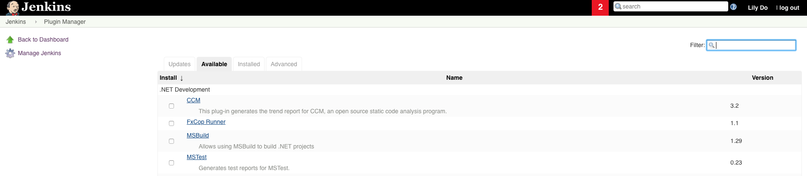

If you are using a different language, you may try to find a suitable plugin for your project if necessary. 

Go to Configure in your Jenkins project. Add a build step, execute shell. 

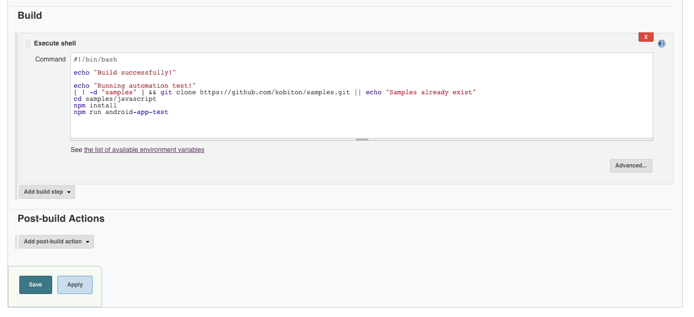

Enter this in the command. Enter your own Kobiton  username and API key as well as the desired device and platform you wish to test with. The below example will execute the android-web-test script sample from Kobiton. 
```
#!/bin/bash
[ ! -d "samples" ] && git clone https://github.com/kobiton/samples.git || echo "Samples already exist"
cd samples/javascript
npm install
npm run android-web-test
```

Under build environment, check the box that says 'Provide Node & npm bin/ folder to PATH'.

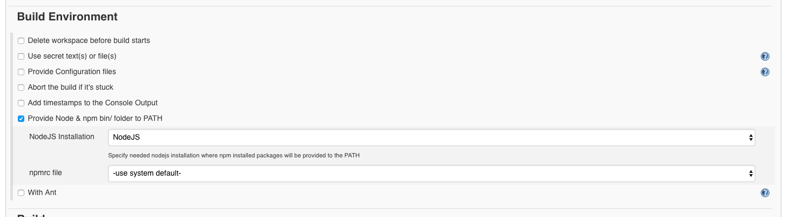

Try Build now and check Kobiton cloud devices to see if a test session was created. 

### 2.3.2 Output

#### Success case

Get all information we can get through public API

**1. Session information**

With this line of code, you can print the session information to the console. 
```javascript
console.log(sessionCapabilities)
```
<!-- to access more specific information within the sessionCapabilities -->

How to get this information:

* Session name
    - sessionCapabilities.sessionName
* Session description
    - sessionCapabilities.sessionDescription
* Device orientation
    - sessionCapabilities.deviceOrientation
* Device name
    - sessionCapabilities.deviceName
* Platform name
    - sessionCapabilities.platformName
* App
    - sessionCapabilities.app
* Kobiton session id
    - sessionCapabilities.kobitonSessionId

**2. Test logs**

* Prepare basic authentication

One way is to insert the following in your test script. 

```javascript
var basicAuth = "Basic " + new Buffer(username + ":" + apiKey).toString("base64"); 
var response = await fetch(`https://api-test.kobiton.com/v1/sessions/${sessionId}`, {
    headers: { 'Authorization': basicAuth }
})
const body = await response.json()
```

How to get the following information:

* App version
```javascript
var appVersionId = body.executionData.desired.appVersionId
var appVersionResponse = await fetch(`https://api-test.kobiton.com/v1/app/versions/${appVersionId}`, {
    headers: { 'Authorization': basicAuth }
})
var appVersionBody = await appVersionResponse.json()
console.log(appVersionBody)
```
* Logs url 
```javascript
body.log
```
* Video url
```javascript
body.video
```
> Note: Log and video URL may not be available immediately

* Commands
```javascript
var commandsResponse = await fetch(`https://api-test.kobiton.com/v1/sessions/${sessionId}/commands`, {
    headers: { 'Authorization': basicAuth }
})
console.log(commandsResponse)
const commandsBody = await commandsResponse.json()
console.log(commandsBody)
```
To get to a certain page in your commands, add the page number to the commands URL. For example:
```javascript
`https://api-test.kobiton.com/v1/sessions/${sessionId}/commands?page=2`
```
> For more details on how to retrieve information about your session, go to https://api.kobiton.com/docs/

**3. Final result**

The test is a either a success or failure.

#### Failure case

* Error: "The environment you requested was unavailable." 
    - This means that the device you selected is already booked. Either select a different device or wait a few moments until your device becomes available
* Other 
    - Contact Kobiton for support